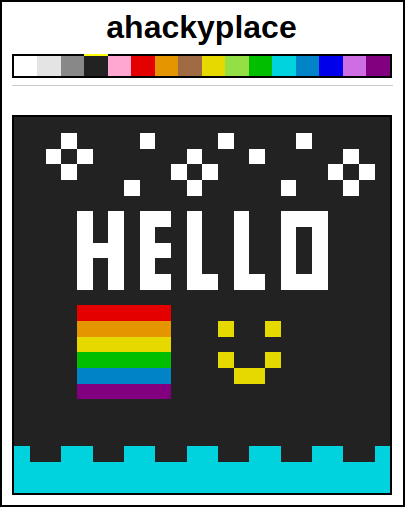

# ahackyplace
A hacky scalable implementation of the [r/place](https://en.wikipedia.org/wiki/Place_%28Reddit%29) concept. Implemented in a weekend, guided by both this [keynote from redislabs](https://www.youtube.com/watch?v=3-Xqghoki70) and this [reddit blogpost](https://redditblog.com/2017/04/13/how-we-built-rplace/).

## Tech Used
- NodeJS (web app)
- WebSockets (streaming newly placed pixels to browser)
- Redis (Storing canvas state and pub/sub messaging between instances)

## Running it for Development 
1. Download  and install Redis Server and Redis CLI on your local machine
2. Using Redis CLI, login to the Redis Server and run the following commands:
 - `SET canvas ""`
 - `SET canvas_width 24` (substitute any value)
 - `SET canvas_height 24` (substitute any value)
 - `SET canvas_bitdepth 4` (only bitdepth of 4 is supported by current front-end)
3. Clone this repository and change directory into it
4. Run `npm install` and `npm run start`

## Adapting for production
The majority of the above applies for production deployment, except your Redis Server will likely not be hosted on the same machine. Ensure that following environment variables are set:
- `NODE_ENV=production`
- `PORT=<your http port here>`
- `REDIS_HOST=<your redis host here>`
- `PORT=<your redis port here>`

If you are using the included Docker configuration note that, `NODE_ENV` and `PORT` are already set in the Dockerfile.

## Attributions
**ahackyplace Code**  
© 2019 Lucas Towers  
Licensed under MIT
